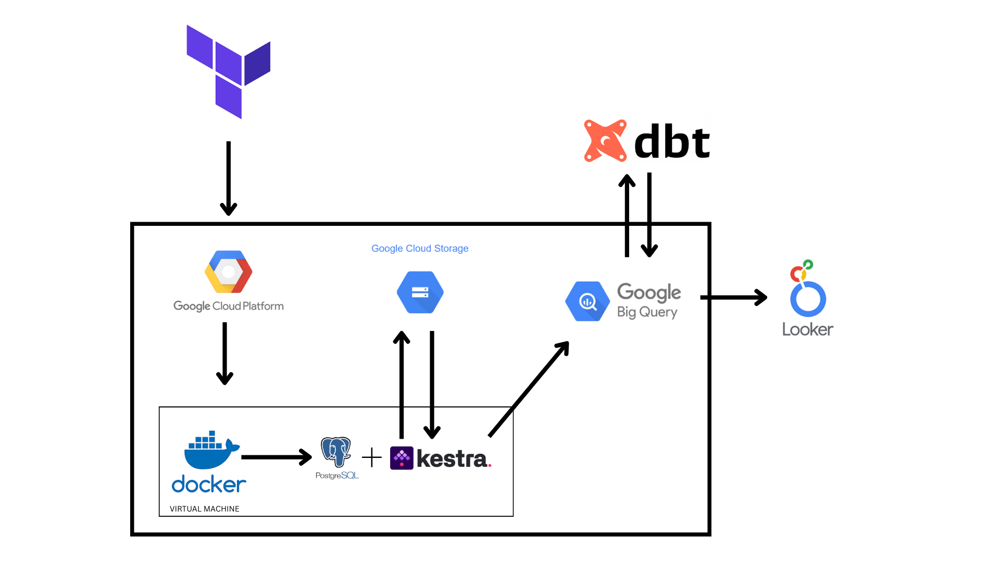

# 🏀 NCAA Basketball ELT Pipeline (GCP + dbt + Kestra)

This project showcases a modern ELT (Extract, Load, Transform) pipeline processing data from the NCAA Basketball dataset. The goal is to demonstrate that an end-to-end data pipeline is fully deployed on the Google Cloud Platform (GCP), from infrastructure provisioning to analytics and visualization. Each tile in looker helps with visualazing aggregated data about players, player events, teams and historical tournaments.

## ⚙️ Technologies Used

- **Google Cloud Platform (GCP)** – Hosts the entire infrastructure.
- **Terraform** – Automates infrastructure provisioning (VM instance, Cloud SQL, GCS, BigQuery...).
- **Docker Compose** – Runs Kestra and PgAdmin on a VM.
- **Kestra** – Workflow orchestration (data ingestion and loading to BigQuery).
- **PostgreSQL (Cloud SQL)** – Metadata backend for Kestra.
- **Google Cloud Storage (GCS)** – Raw file storage.
- **BigQuery** – Cloud data warehouse for analytical models.
- **dbt (Data Build Tool)** – Transforms raw data into analytical models in BigQuery.
- **Looker** – Business intelligence and data visualization layer.

## 🔄 ELT Data Flow

1. **Infrastructure Provisioning**  
   Terraform creates all necessary GCP resources:
   - VM instance (Compute Engine)
   - Cloud SQL (PostgreSQL)
   - GCS bucket for raw data
   - BigQuery datasets

2. **Workflow Orchestration with Kestra**  
   - Kestra runs on a Docker container inside the VM
   - Kestra workflows:
     - Download raw data (e.g., public API or datasets)
     - Store data in GCS
     - Load data from GCS to BigQuery (raw tables)

3. **Data Transformation with dbt**  
   - dbt models transform raw data into intermediate, dimensional, and fact layers
   - Results are materialized in BigQuery

4. **Visualization with Looker**  
   - Transformed data is explored and visualized in Looker dashboards
   - Dashboards highlight player performance, team stats, game events, and trends

## 📦 Deployment Stack

Infrastructure and services are managed with:
- `Terraform` for provisioning cloud resources
- `Docker Compose` for running Kestra and PgAdmin on the VM

## 📊 Architecture Diagram

## 📁 Project Structure
├── terraform/ # Terraform config for GCP resources 
├── kestra/ # Kestra workflows (YAML) 
├── dbt/ # dbt project for data modeling 
├── docker/ # Deployment of Kestra and PgAdmin 
├── README.md # Project overview

## Manual for deployment
First, let's create the SSH key for the Virtual machine  
Generate SSH key: 

https://cloud.google.com/compute/docs/connect/add-ssh-keys
https://cloud.google.com/compute/docs/connect/create-ssh-keys#windows-10-or-later

Windows:

`ssh-keygen -t rsa -f C:\Users\WINDOWS_USER\.ssh\KEY_FILENAME -C USERNAME`

Linux:  
`ssh-keygen -t rsa -f ~/.ssh/KEY_FILENAME -C USERNAME`
