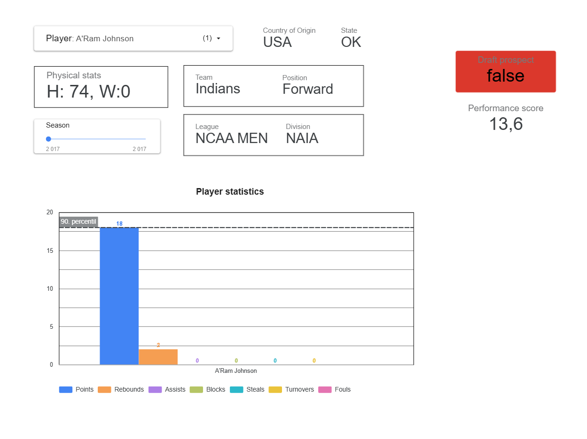
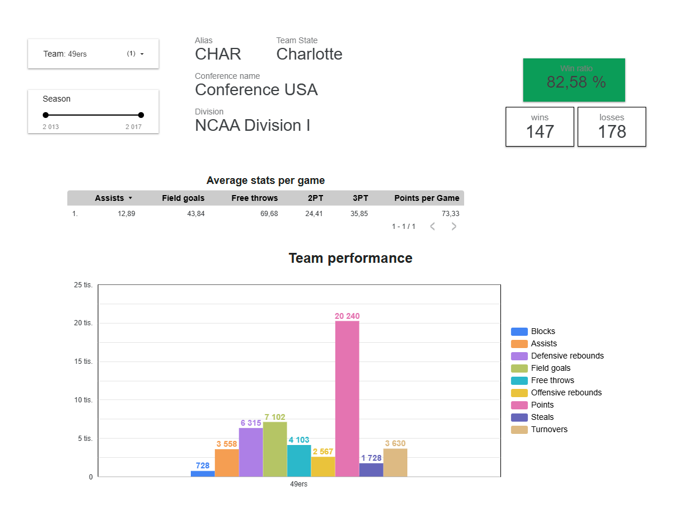

# 🏀 NCAA Basketball ELT Pipeline (GCP + dbt + Kestra)

This project showcases a modern ELT (Extract, Load, Transform) pipeline processing data from the NCAA Basketball dataset. The goal is to demonstrate that an end-to-end data pipeline is fully deployed on the Google Cloud Platform (GCP), from infrastructure provisioning to analytics and visualization. Each tile in looker helps with visualazing aggregated data about players, player events, teams and historical tournaments.

## ⚙️ Technologies Used

- **Google Cloud Platform (GCP)** – Hosts the entire infrastructure.
- **Terraform** – Automates infrastructure provisioning (VM instance, Cloud SQL, GCS, BigQuery...).
- **Docker Compose** – Runs Kestra and PgAdmin on a VM.
- **Kestra** – Workflow orchestration (data ingestion and loading to BigQuery).
- **PostgreSQL (Cloud SQL)** – Metadata backend for Kestra.
- **Google Cloud Storage (GCS)** – Raw file storage.
- **BigQuery** – Cloud data warehouse for analytical models.
- **dbt (Data Build Tool)** – Transforms raw data into analytical models in BigQuery.
- **Looker** – Business intelligence and data visualization layer.

## 🔄 ELT Data Flow

1. **Infrastructure Provisioning**  
   Terraform creates all necessary GCP resources:
   - VM instance (Compute Engine)
   - Cloud SQL (PostgreSQL)
   - GCS bucket for raw data
   - BigQuery datasets

2. **Workflow Orchestration with Kestra**  
   - Kestra runs on a Docker container inside the VM
   - Kestra workflows:
     - Download raw data (e.g., public API or datasets)
     - Store data in GCS
     - Load data from GCS to BigQuery (raw tables)

3. **Data Transformation with dbt**  
   - dbt models transform raw data into intermediate, dimensional, and fact layers
   - Results are materialized in BigQuery

4. **Visualization with Looker**  
   - Transformed data is explored and visualized in Looker dashboards
   - Dashboards highlight player performance, team stats, game events, and trends

## 📦 Deployment Stack

Infrastructure and services are managed with:
- `Terraform` for provisioning cloud resources
- `Docker Compose` for running Kestra and PgAdmin on the VM

## 📊 Architecture Diagram

## Visuals

 

  

  

## 📁 Project Structure
├── terraform/ # Terraform config for GCP resources 
├── kestra/ # Kestra workflows (YAML) 
├── dbt/ # dbt project for data modeling 
├── docker/ # Deployment of Kestra and PgAdmin 
├── README.md # Project overview

## Manual for deployment
First, let's create the SSH key for the Virtual machine  
Generate SSH key: 

https://cloud.google.com/compute/docs/connect/add-ssh-keys
https://cloud.google.com/compute/docs/connect/create-ssh-keys#windows-10-or-later

Windows:
<pre lang="markdown"> ssh-keygen -t rsa -f C:\Users\WINDOWS_USER\.ssh\KEY_FILENAME -C USERNAME</pre>  

Linux:<pre lang="markdown"> ssh-keygen -t rsa -f ~/.ssh/KEY_FILENAME -C USERNAME</pre>   

Create the project on the Google Cloud Console. The Terraform will automatically use Application Default Account (your Gmail to create the Infrastructure.  
It will create one service account with all the necessary permissions (not the best practice, but for the project it will do) After that, it will download the key JSON file  
into the terraform folder, which will be used later.
If the GOOGLE_APPLICATION_CREDENTIALS environment variable is set, it will override ADC. 
Use any of these in the terminal:
<pre lang="markdown">Remove-Item Env:GOOGLE_APPLICATION_CREDENTIALS</pre>
<pre lang="markdown">$Env:GOOGLE_APPLICATION_CREDENTIALS</pre>

Establish ADC with gcloud auth application-default login
Check with:

gcloud auth list 

set correctly with:
<pre lang="markdown">gcloud projects add-iam-policy-binding ncaa-project-455618 \
--member="user: YOUR GMAIL HERE" \
--role="roles/serviceusage.serviceUsageConsumer"</pre>

Now that this is set up, just add the project's ID as the default connected project on GCloud:
<pre lang="markdown">`gcloud auth application-default set-quota-project PROJECT-ID`</pre>

Now, all that is needed is simple. It will take some time to set up. PostgreSQL and Dataproc usually takes about 4 - 5 min:
<pre lang="markdown">`terraform init`</pre>
<pre lang="markdown">`terraform plan`</pre>
<pre lang="markdown">`terraform apply`</pre>

Logging into the VM with SSH key. You need the external IP from the VM on GCloud when it is running.  
Check the External IP to connect to the VM machine.  
With a command, you can access the VM or create a config file witha  structure like this
<pre lang="markdown">ssh -i ~/.ssh/gcp_ssh user@externalip</pre> 

<pre lang="markdown">Host vm-instance-1
    HostName externalIP
    User user
    IdentityFile c:/Users/user/.ssh/gpc_ssh</pre>

Then run sftp to transfer Google credentials for Google Cloud. Navigate to your directory where the JSON credentials are based on Terraform it should be „/terraform/gcp_credentisl.json“
Running the sftp with:
<pre lang="markdown">sftp vm-instance-1
mkdir .gc
cd .gc
put gcp_credentials.json</pre>

The only thing left is to copy this repo onto the VM machine with:
<pre lang="markdown"> git clone ..... </pre>
Now it is done!

Now, before running the Docker compose, Kestra needs the IP of the SQL DB and stringified credentials added.
You can stringify the JSON with: 

<pre lang="markdown">cat gcp_credentials.json | jq '@json'</pre>
Copy the output at put it in the highlighted part of the docker-compose.yaml  

Navigate to the Docker directory and run the Docker-compose file with sudo docker build.

<pre lang="markdown">docker-compose up -d</pre>

Now the latest Kestra image should be pulled up and running with a connection to the GCP PostgreSQL. The kestra interface will be on externalIP:8080 port
with credentials like those in the Docker-Compose file.

Then creating the first workflow with value keys for GCP, where the variables for Kestra key-value store from terraform, like dataset, bucket, and location. 

Now add the export_from_bq_to_gcs, then create_tables_in_bq, and the last is load_csv_to_bq.  
This workflow orchestration is automated with dependencies to start every Monday at 3:00 am

After that is done, now comes the dbt cloud platform to change, or rather, transform the data. From staging to core models and finally data marts models with facts and dimensinals table based on Kimballs star schema.

After that the project is visualized in Google Looker with 3 tiles below to show team performance, player events (shooting, fouls, and rebounding with map of the field to show where it happened and description with pie graphs to show events and player basic statistics (points, rebounds, steal,s etc.)

